# Futures Marketplace Infrastructure - DEV Environment

## Architecture Diagram

```mermaid
graph TB
    subgraph "External Access"
        Users[External Users/DApps]
        Telegram[Telegram API]
    end

    subgraph "Route53 DNS"
        DNS1[graphidx.dev.lumerin.io]
        DNS2[notifyint.dev.lumerin.io]
    end

    subgraph "Futures Marketplace Infrastructure"
        
        subgraph "Subgraph Indexer - Public"
            ALB_Subgraph[External ALB<br/>graphidx-ext-use1<br/>:443 HTTPS]
            
            subgraph "ECS Fargate - Graph Node"
                GraphNode[Graph Node Container<br/>512 CPU / 1024 MB<br/>Ports: 8000, 8001, 8020, 8030]
            end
            
            subgraph "ECS Fargate - IPFS"
                IPFS[IPFS Container<br/>256 CPU / 512 MB<br/>Ports: 5001, 8080]
            end
            
            RDS_Subgraph[(RDS PostgreSQL<br/>db.t3.small<br/>50-200 GB)]
            EFS_IPFS[/EFS Volume<br/>20 GB<br/>IPFS Data/]
            SD[Service Discovery<br/>subgraph.local<br/>ipfs:5001]
        end

        subgraph "Notifications Service - Internal"
            ALB_Notif[Internal ALB<br/>notifyint-int-use1<br/>:443 HTTPS]
            
            subgraph "ECS Fargate - Notifications"
                NotifSvc[Notifications Bot<br/>256 CPU / 512 MB<br/>Port: 3000<br/>Telegram Bot]
            end
            
            RDS_Notif[(RDS PostgreSQL<br/>db.t3.micro<br/>20-50 GB<br/>User Subscriptions)]
        end

        subgraph "Margin Call Lambda"
            EB[EventBridge Schedule<br/>Every 15 minutes]
            Lambda[Lambda Function<br/>Node.js 22.x<br/>512 MB / 5 min timeout<br/>VPC Enabled]
            CW_Alarms[CloudWatch Alarms<br/>Errors & Duration]
        end

        subgraph "Shared Resources"
            Secrets[AWS Secrets Manager<br/>futures-marketplace-secrets-dev<br/>• telegram_bot_token<br/>• margin_call_ethereum_rpc_url<br/>• subgraph_ethereum_rpc_url]
            CloudWatch[CloudWatch Logs<br/>5 Log Groups<br/>7-day retention]
        end

        subgraph "External Dependencies"
            Ethereum[Ethereum RPC<br/>Arbitrum Sepolia<br/>Alchemy]
            FuturesContract[Futures Smart Contract<br/>0x34bedcf9...]
            OracleContract[Hashrate Oracle<br/>0x6F736186...]
        end
    end

    %% User flows
    Users -->|GraphQL Queries| DNS1
    DNS1 --> ALB_Subgraph
    ALB_Subgraph --> GraphNode
    
    %% Telegram interactions
    Telegram <-->|Webhook/API| NotifSvc
    
    %% Lambda to Notifications flow
    EB -->|Trigger| Lambda
    Lambda -->|POST /notifications| DNS2
    DNS2 --> ALB_Notif
    ALB_Notif --> NotifSvc
    
    %% Data dependencies
    GraphNode -->|Query| RDS_Subgraph
    GraphNode -->|Store| IPFS
    GraphNode -->|Fetch via DNS| SD
    SD -.->|ipfs.subgraph.local:5001| IPFS
    IPFS -->|Mount| EFS_IPFS
    
    NotifSvc -->|Store Users| RDS_Notif
    
    Lambda -->|Read Positions| DNS1
    Lambda -->|Query Subgraph| GraphNode
    
    %% Blockchain interactions
    GraphNode -->|Index Events| Ethereum
    Lambda -->|Read Oracle| OracleContract
    Lambda -->|Check Positions| FuturesContract
    
    %% Secrets access
    NotifSvc -.->|Read telegram_bot_token| Secrets
    Lambda -.->|Read margin_call_ethereum_rpc_url| Secrets
    GraphNode -.->|Read subgraph_ethereum_rpc_url| Secrets
    
    %% Logging
    GraphNode -.->|Logs| CloudWatch
    IPFS -.->|Logs| CloudWatch
    NotifSvc -.->|Logs| CloudWatch
    Lambda -.->|Logs| CloudWatch
    
    %% Monitoring
    Lambda -.->|Metrics| CW_Alarms

    classDef public fill:#e1f5ff,stroke:#0066cc,stroke-width:2px
    classDef internal fill:#fff4e6,stroke:#ff9800,stroke-width:2px
    classDef storage fill:#f3e5f5,stroke:#9c27b0,stroke-width:2px
    classDef external fill:#e8f5e9,stroke:#4caf50,stroke-width:2px
    classDef compute fill:#fff3e0,stroke:#ff6f00,stroke-width:2px
    
    class ALB_Subgraph,GraphNode,DNS1 public
    class ALB_Notif,NotifSvc,DNS2 internal
    class RDS_Subgraph,RDS_Notif,EFS_IPFS,Secrets storage
    class Ethereum,FuturesContract,OracleContract,Telegram external
    class Lambda,EB compute
```



## Component Details

### 1. Subgraph Indexer (Public Access)
**Purpose:** Index and query blockchain data for the Futures Marketplace

**Components:**
- **External ALB**: `graphidx.dev.lumerin.io` - Public HTTPS endpoint
- **Graph Node ECS**: Indexes blockchain events, serves GraphQL queries
- **IPFS ECS**: Stores subgraph metadata and deployment files
- **RDS PostgreSQL**: Stores indexed blockchain data (db.t3.small)
- **EFS Volume**: Persistent IPFS data storage (20 GB)
- **Service Discovery**: Internal DNS for Graph Node → IPFS communication

**Flow:**
1. External users query GraphQL endpoint via ALB
2. Graph Node reads from Ethereum RPC (Arbitrum Sepolia)
3. Graph Node stores indexed data in PostgreSQL
4. Graph Node stores subgraph files in IPFS
5. IPFS persists data to EFS volume

**Ports:**
- 8000: GraphQL HTTP queries
- 8001: GraphQL WebSocket subscriptions
- 8020: Admin/management API
- 8030: Prometheus metrics

---

### 2. Notifications Service (Internal Only)
**Purpose:** Telegram bot for margin call alerts and user notifications

**Components:**
- **Internal ALB**: `notifyint.dev.lumerin.io` - VPC-only access
- **Notifications ECS**: Node.js Telegram bot service
- **RDS PostgreSQL**: Stores user subscriptions and notification history (db.t3.micro)

**Flow:**
1. Margin Call Lambda triggers notifications via internal ALB
2. Notifications service sends alerts to Telegram users
3. Users can subscribe/unsubscribe via Telegram commands
4. Subscription data stored in PostgreSQL

**API Endpoints:**
- `POST /notifications` - Trigger margin call alerts
- `GET /healthcheck` - Service health status

---

### 3. Margin Call Lambda
**Purpose:** Monitor positions and trigger margin call notifications

**Components:**
- **Lambda Function**: Node.js 22.x, 512 MB memory, 5-minute timeout
- **EventBridge Schedule**: Runs every 15 minutes
- **CloudWatch Alarms**: Monitors errors and execution duration
- **VPC Configuration**: Access to internal ALB and RDS

**Flow:**
1. EventBridge triggers Lambda every 15 minutes
2. Lambda queries Subgraph for open positions
3. Lambda reads current hashrate price from Oracle contract
4. Lambda calculates margin ratios for each position
5. If position at risk (< 10% margin), POST to Notifications service
6. Notifications service sends Telegram alert to position owner

**Environment Variables:**
- `ETHEREUM_RPC_URL`: Arbitrum Sepolia RPC endpoint
- `SUBGRAPH_URL`: Graph Node GraphQL endpoint
- `FUTURES_ADDRESS`: Futures smart contract address
- `HASHRATE_ORACLE_ADDRESS`: Oracle contract address
- `NOTIFICATIONS_SERVICE_URL`: Internal ALB endpoint
- `MARGIN_THRESHOLD`: Alert threshold (default: 0.1 = 10%)

---

## Resource Summary

| Service | ECS Tasks | RDS | ALB | Lambda | EFS |
|---------|-----------|-----|-----|--------|-----|
| **Notifications** | 1 (256/512) | db.t3.micro | Internal | - | - |
| **Margin Call** | - | - | - | 1 (512 MB) | - |
| **Subgraph** | 2 (768/1536 total) | db.t3.small | External | - | 20 GB |
| **TOTAL** | 3 tasks | 2 instances | 2 ALBs | 1 function | 20 GB |

---

## Security & Access

### Public Access
- ✅ Subgraph GraphQL endpoint (graphidx.dev.lumerin.io)
  - Protected by WAF
  - HTTPS only (ACM certificate)
  - Rate limiting via WAF rules

### Internal Only
- 🔒 Notifications Service ALB (notifyint.dev.lumerin.io)
  - VPC-internal only
  - Only accessible by Lambda and ECS services
  - No public internet access

### Secrets Management
- All sensitive data stored in AWS Secrets Manager
- Single consolidated secret: `futures-marketplace-secrets-dev`
- Automatic rotation support
- IAM-based access control

### Network Isolation
- ECS tasks run in private subnets
- RDS instances in private subnets with security groups
- Lambda has VPC access for internal communication
- No direct internet access to databases

---

## Monitoring & Observability

### CloudWatch Logs (7-day retention)
1. `/ecs/lumerin-notifications-dev` - Notifications bot logs
2. `/ecs/lumerin-graph-node-dev` - Graph Node indexing logs
3. `/ecs/lumerin-ipfs-dev` - IPFS daemon logs
4. `/aws/lambda/margin-call-dev` - Lambda execution logs

### CloudWatch Alarms
1. **Lambda Error Rate** - Triggers if error rate > 1%
2. **Lambda Duration** - Triggers if execution time > 4 minutes

### Metrics Available
- Graph Node: Prometheus metrics on port 8030
- Lambda: Duration, invocations, errors, throttles
- ECS: CPU, memory, network utilization
- RDS: Connections, storage, IOPS
- ALB: Request count, latency, target health

---

## Cost Breakdown (Monthly - DEV)

| Component | Service | Cost |
|-----------|---------|------|
| **Notifications** | ECS Fargate (1 task) | ~$15 |
|  | RDS db.t3.micro | ~$15 |
|  | Internal ALB | ~$20 |
| **Margin Call** | Lambda (720 invocations/month) | ~$2 |
| **Subgraph** | ECS Fargate (2 tasks) | ~$30 |
|  | RDS db.t3.small | ~$30 |
|  | EFS 20 GB | ~$6 |
|  | External ALB | ~$20 |
| **Shared** | Secrets Manager (1 secret) | $0.40 |
|  | CloudWatch Logs | ~$5 |
|  | Data Transfer | ~$8 |
| **TOTAL** | | **~$152/month** |

---

## Data Flow: Margin Call Example

```
1. EventBridge (every 15 min)
   ↓
2. Margin Call Lambda triggered
   ↓
3. Lambda → queries subgraph at graphidx.dev.lumerin.io
   Query: "Get all open positions"
   ↓
4. Lambda → reads Oracle contract (via Ethereum RPC)
   Query: "Get current hashrate price"
   ↓
5. Lambda calculates: margin_ratio = collateral / (position_size × current_price)
   ↓
6. IF margin_ratio < 0.1 (10%)
   ↓
7. Lambda → POST to notifyint.dev.lumerin.io/notifications
   Body: { positionId, userId, currentMargin, requiredMargin }
   ↓
8. Notifications Service → Telegram API
   Message: "⚠️ Margin Call Alert: Your position #123 is at 8% margin..."
   ↓
9. User receives Telegram notification
```

---

## Deployment Information

**Created by:** Terraform/Terragrunt
**Environment:** DEV (titanio-dev account)
**Region:** us-east-1
**VPC:** vpc-0ca514c44b636cb40
**Deployment Date:** 2025-10-15

**DNS Records:**
- `graphidx.dev.lumerin.io` → External ALB (Subgraph)
- `notifyint.dev.lumerin.io` → Internal ALB (Notifications)
- `ipfs.subgraph.local` → Service Discovery (IPFS)

**Terraform Files:**
- `.terragrunt/06_notifications_service.tf`
- `.terragrunt/07_margin_call_lambda.tf`
- `.terragrunt/08_subgraph_indexer.tf`
- `.terragrunt/01_secrets_manager.tf`
- `02-dev/terraform.tfvars`
- `02-dev/secret.auto.tfvars`

